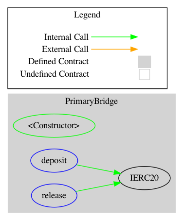
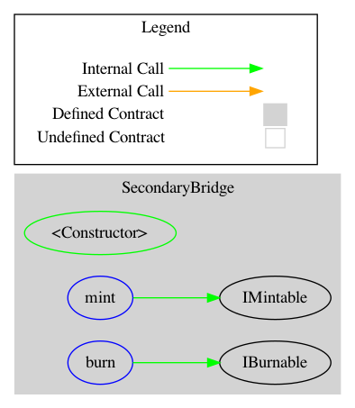
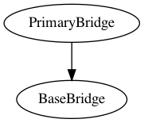
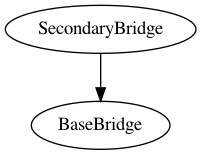

<div id="splash">
    <div id="project">
          <span class="splash-title">
               Project
          </span>
          <br />
          <span id="project-value">
               HALO Token Bridge
          </span>
    </div>
     <div id="details">
          <div id="left">
               <span class="splash-title">
                    Client
               </span>
               <br />
               <span class="details-value">
                    HaloDAO
               </span>
               <br />
               <span class="splash-title">
                    Date
               </span>
               <br />
               <span class="details-value">
                    August 2021
               </span>
          </div>
          <div id="right">
               <span class="splash-title">
                    Reviewers
               </span>
               <br />
               <span class="details-value">
                    Andrei Simion
               </span><br />
               <span class="contact">@andreiashu</span>
               <br />
               <span class="details-value">
                    Daniel Luca
               </span><br />
               <span class="contact">@cleanunicorn</span>
          </div>
    </div>
</div>


## Table of Contents
 - [Details](#details)
 - [Issues Summary](#issues-summary)
 - [Executive summary](#executive-summary)
 - [Scope](#scope)
 - [Recommendations](#recommendations)
     - [Increase the number of tests](#increase-the-number-of-tests)
 - [Issues](#issues)
     - [Consider adding a nonce to track each deposit / burn operation](#consider-adding-a-nonce-to-track-each-deposit--burn-operation)
 - [Artifacts](#artifacts)
     - [Surya](#surya)
 - [Sūrya's Description Report](#suryas-description-report)
     - [Files Description Table](#files-description-table)
     - [Contracts Description Table](#contracts-description-table)
     - [Legend](#legend)
     - [Coverage](#coverage)
     - [Tests](#tests)
 - [License](#license)


## Details

- **Client** HaloDAO
- **Date** August 2021
- **Lead reviewer** Andrei Simion ([@andreiashu](https://twitter.com/andreiashu))
- **Reviewers** Daniel Luca ([@cleanunicorn](https://twitter.com/cleanunicorn)), Andrei Simion ([@andreiashu](https://twitter.com/andreiashu))
- **Repository**: [HALO Token Bridge](git@github.com:HaloDAO/token-bridge.git)
- **Commit hash** `7fab901ff5aa136972ce2533f39f8d912e5e363c`
- **Technologies**
  - Solidity
  - TypeScript

## Issues Summary

| SEVERITY       |    OPEN    |    CLOSED    |
|----------------|:----------:|:------------:|
|  Informational  |  0  |  1  |
|  Minor  |  0  |  0  |
|  Medium  |  0  |  0  |
|  Major  |  0  |  0  |

## Executive summary

This report represents the results of the engagement with **HaloDAO** to review **HALO Token Bridge**.

The review is part of a broader engagement with HaloDAO that includes several other components from the HaloDAO ecosystem (Halo Rewards, Halo AMM, Halo Bridge, Halo Bridge Handler).

The full review (across above-mentioned repositories) was conducted over the course of **2 weeks** from **16th of August to 27th of August, 2021**. We spent a total of **20 person-days** reviewing the code.

## Scope

The initial review focused on the [HALO Token Bridge](git@github.com:HaloDAO/token-bridge.git) repository, identified by the commit hash `7fab901ff5aa136972ce2533f39f8d912e5e363c`.

We focused on manually reviewing the codebase, searching for security issues such as, but not limited to, re-entrancy problems, transaction ordering, block timestamp dependency, exception handling, call stack depth limitation, integer overflow/underflow, self-destructible contracts, unsecured balance, use of origin, costly gas patterns, architectural problems, code readability.

**Includes:**

 - code/contracts/SecondaryBridge.sol
 - code/contracts/BaseBridge.sol
 - code/contracts/PrimaryBridge.sol

## Recommendations

We identified a few possible general improvements that are not security issues during the review, which will bring value to the developers and the community reviewing and using the product.

### Increase the number of tests

A good rule of thumb is to have 100% test coverage. This does not guarantee a lack of security problems, but it means that the desired functionality behaves as intended. The negative tests also bring value because not allowing some actions to happen is also part of the desired behavior.


## Issues


### [Consider adding a nonce to track each deposit / burn operation](https://github.com/monoceros-alpha/review-halo-token-bridge-2021-08/issues/1)
 

**Description**

When a user wants to cross the bridge, they can `deposit` some tokens into the contract by calling `PrimaryBridge.deposit()`.


[code/contracts/PrimaryBridge.sol#L21-L29](https://github.com/monoceros-alpha/review-halo-token-bridge-2021-08/blob/96ddd26aa73190d71b2b7413c008e6516b8fd29b/code/contracts/PrimaryBridge.sol#L21-L29)
```solidity
	function deposit(uint256 amount, uint256 chainId) external returns (bool) {
		require(amount > 0, 'Amount must be greater than 0');

		IERC20(_token).safeTransferFrom(msg.sender, self, amount);
		amountHeld += amount;
		_balances[chainId] += amount;
		emit DepositReceived(amount, chainId, block.timestamp, msg.sender);
		return true;
	}
```

In this case, their tokens are locked in the bridge, some accounting is done, and an event is emitted.


[code/contracts/PrimaryBridge.sol#L27](https://github.com/monoceros-alpha/review-halo-token-bridge-2021-08/blob/96ddd26aa73190d71b2b7413c008e6516b8fd29b/code/contracts/PrimaryBridge.sol#L27)
```solidity
		emit DepositReceived(amount, chainId, block.timestamp, msg.sender);
```

If the same user calls the `deposit` method twice, with the same value, in the same block, 2 identical events will be emitted by the contract.

Each event will have the same:

- `amount`
- `chainId`
- `block.timestamp`
- `msg.sender`

The service watching the contract for events can't differentiate between these 2 deposits. The service also needs to call `SecondaryBridge.mint()` on the destination `chainId`.

To better track each `deposit` and paired `mint`, a `nonce` can be generated by the `PrimaryBridge` to make sure the same `deposit` was executed once and only once. 

Having a `nonce` will help track each individual `deposit` and make sure that each `deposit` was executed on the destination chain.

The contract needs to keep track of the nonces and can respond with `true` or `false` (and possibly other info) to make sure the same bridge cross was executed on the destination chain.

This reduces the responsibility of the relayer because tracking each deposit that happens in the contract, which provides more security, helps with duplicate prevention as well as having a confirmation available on-chain for each deposit.

Consider this highly simplified example.

A user wants to cross the bridge; thus, they need to call the `PrimaryBridge.deposit()` below.

```solidity
import {IERC20} from './IERC20.sol';

contract PrimaryBridge {
    event DepositReceived(
        uint256 nonce,
        uint256 amount, 
        uint256 chainId, 
        uint256 timestamp, 
        address indexed from
    );
    
    address internal _token;
    uint public nextNonce;
    
    function deposit(uint amount, uint chainId) external {
        IERC20(_token).transferFrom(msg.sender, address(this), amount); 
        
        // Get the current nonce
        uint currentNonce = nextNonce;
        
        // Increment the next nonce
        nextNonce += 1;
        
        // Emit an event containing the current nonce.
        //
        // This `nonce` needs to be sent by the relayer to the `SecondaryBridge.mint()` method
        // to correctly an uniquely track each deposit.
        emit DepositReceived(
            currentNonce,
            amount, 
            chainId, 
            block.timestamp, 
            msg.sender
        );
    }
}
```

Once the method was executed successfully, an event is emitted containing the currently implemented values, as well as a generated unique nonce. This unique nonce is then used by the relayer. Also, this nonce can be useful for the user to track and prove their transaction was not mined (in case the relayer is faulty).

The relayer picks up the event and has to call `SecondaryBridge.mint()` to create the user's tokens on the destination chain.

```solidity
import {IERC20} from './IERC20.sol';

contract Secondary {
    event Minted(
        uint nonce,
        uint amount,
        uint timestamp,
        address indexed to,
        uint chainId
    );

    uint256 private _chainId;
    address internal _token;
    mapping(uint => bool) public nonces;

    function mint(
        // This nonce is sent by the relayer
        // it's the one the method `PrimaryBridge.deposit()` emitted
        uint nonce,
        address account,
        uint amount
    ) external returns (bool) {
        // Make sure this nonce was not used before
        require(nonces[nonce] == false, "Deposit already processed");

        // Mark this nonce as used
        nonces[nonce] = true;

        // Create the tokens
        IERC20(_token).mint(account, amount);

        // Emit an event containing this nonce along with all the other details
        emit Minted(nonce, amount, block.timestamp, account, _chainId);

        return true;
    }
}
```

This time the `mint` method has an additional argument: `nonce`. Which uniquely identifies the user's deposit. The relayer has to provide this argument to make sure the deposit is uniquely tracked. 

Because of this check, each deposit is executed only once, even if the relayer software has a bug and calls the `mint` method multiple times.

```solidity
        // Make sure this nonce was not used before
        require(nonces[nonce] == false, "Deposit already processed");
```

If the relayer misbehaves and does not process all deposits, checking if a nonce was processed simplifies providing support for the affected user. This is possible because a public nonce mapping is available in the contract.

```solidity
    mapping(uint => bool) public nonces;
```

This can be cross-checked with the events emitted by the `PrimaryBridge`; thus, if a nonce was not processed, the event emitting that nonce has all of the necessary details to solve the users' issue.

A few additional things need to be considered:

- You might want to generate individual nonces for each chain. Because there is a `PrimaryBridge`, you could have multiple `SecondaryBridges`; thus, it might help you to track each chain separately. Each chain can have its own list of nonces.
- Moving from `PrimaryBridge` to `SecondaryBridge` was discussed above, but also the inverse operation also needs to be tracked. Make sure you similarly track `SecondaryBridge.burn` to `PrimaryBridge.release`.
- This is extremely simplified. The code is super slim; make sure not to copy-paste. It's just a proof of concept.
- Depending on the amount of complexity you want to add, a structure describing each deposit / burn can be saved in the contract. If you want to later provide or check the actions on-chain, the contract needs to have information about the deposits and the burns. The events are not visible to any of the contracts on-chain. They only serve off-chain services.
- Crossing the bridge heavily relies on the relayer running correctly. An upgrade of your system can provide a mechanism for the user to trigger mint / release themselves if they provide correct cryptographic proof. This, however, will add significant complexity.

**Recommendation**

Consider adding a unique tracking mechanism similar to the `nonce` example above to reduce the responsibility of the relayer software, help track successful / un-executed deposits easier and move some of the reliability concerns on-chain.


---


## Artifacts

### Surya

Sūrya is a utility tool for smart contract systems. It provides several visual outputs and information about the structure of smart contracts. It also supports querying the function call graph in multiple ways to aid in the manual inspection and control flow analysis of contracts.


## Sūrya's Description Report

### Files Description Table

|  File Name  |  SHA-1 Hash  |
|-------------|--------------|
| code/contracts/BaseBridge.sol | 752cfb8c117edac90f87104444078d0ec5be2480 |
| code/contracts/IBurnable.sol | e6b632aa80ff808996b148e3f0adde37e0529056 |
| code/contracts/IMintable.sol | ef5d9ca863a3f6bb3dbfab573e293e4e9a524383 |
| code/contracts/Migrations.sol | 69b8fd36420e55cf1274bec2e70399dddcd700fc |
| code/contracts/MockToken.sol | cafd16a26f3b04f9d7d70014fe2671d3b628edfc |
| code/contracts/PrimaryBridge.sol | 3e7e0fffa8354618c19787f6290d27c32e92248b |
| code/contracts/SecondaryBridge.sol | 40f5eb2252854ba80e3c8eac9c94151c38514400 |


### Contracts Description Table

|  Contract  |         Type        |       Bases      |                  |                 |
|:----------:|:-------------------:|:----------------:|:----------------:|:---------------:|
|     └      |  **Function Name**  |  **Visibility**  |  **Mutability**  |  **Modifiers**  |
||||||
| **BaseBridge** | Implementation | Ownable |||
| └ | balanceOf | External ❗️ |   |NO❗️ |
| └ | bridgeToken | External ❗️ |   |NO❗️ |
| └ | updateAuthorised | Public ❗️ | 🛑  | onlyOwner |
||||||
| **IBurnable** | Interface |  |||
| └ | burnFrom | External ❗️ | 🛑  |NO❗️ |
||||||
| **IMintable** | Interface | IERC20 |||
| └ | mint | External ❗️ | 🛑  |NO❗️ |
||||||
| **Migrations** | Implementation |  |||
| └ | setCompleted | Public ❗️ | 🛑  | restricted |
||||||
| **MockToken** | Implementation | IERC20, ERC20Burnable, Ownable |||
| └ | <Constructor> | Public ❗️ | 🛑  | ERC20 |
| └ | mint | External ❗️ | 🛑  |NO❗️ |
||||||
| **PrimaryBridge** | Implementation | BaseBridge |||
| └ | <Constructor> | Public ❗️ | 🛑  |NO❗️ |
| └ | deposit | External ❗️ | 🛑  |NO❗️ |
| └ | release | External ❗️ | 🛑  | onlyAuthorised |
||||||
| **SecondaryBridge** | Implementation | BaseBridge |||
| └ | <Constructor> | Public ❗️ | 🛑  |NO❗️ |
| └ | mint | External ❗️ | 🛑  | onlyAuthorised |
| └ | burn | External ❗️ | 🛑  |NO❗️ |

### Legend

|  Symbol  |  Meaning  |
|:--------:|-----------|
|    🛑    | Function can modify state |
|    💵    | Function is payable |


#### Graphs

***PrimaryBridge***

```text
surya graph code/contracts/PrimaryBridge.sol | dot -Tpng > ./static/PrimaryBridge_Contract.png
```



***SecondaryBridge***

```text
surya graph code/contracts/SecondaryBridge.sol | dot -Tpng > ./static/SecondaryBridge_Contract.png
```



#### Inheritance

```text
surya inheritance code/contracts/PrimaryBridge.sol | dot -Tpng > ./static/PrimaryBridge_inheritance.png
```



```text
surya inheritance code/contracts/SecondaryBridge.sol | dot -Tpng > ./static/SecondaryBridge_inheritance.png
```


#### Describe

```text
$ npx surya describe ./code/contracts/PrimaryBridge.sol
 +  PrimaryBridge (BaseBridge)
    - [Pub] <Constructor> #
    - [Ext] deposit #
    - [Ext] release #
       - modifiers: onlyAuthorised


 ($) = payable function
 # = non-constant function
```

```text
$ npx surya describe ./code/contracts/SecondaryBridge.sol
 +  SecondaryBridge (BaseBridge)
    - [Pub] <Constructor> #
    - [Ext] mint #
       - modifiers: onlyAuthorised
    - [Ext] burn #


 ($) = payable function
 # = non-constant function
```

### Coverage

```text
$ yarn add  --dev solidity-coverage

# added import "solidity-coverage" to hardhat.config.ts file

$ npx hardhat coverage

Version
=======
> solidity-coverage: v0.7.16

Instrumenting for coverage...
=============================

> BaseBridge.sol
> IBurnable.sol
> IMintable.sol
> Migrations.sol
> MockToken.sol
> PrimaryBridge.sol
> SecondaryBridge.sol

Compilation:
============

Compiling 15 files with 0.8.6
Generating typings for: 15 artifacts in dir: typechain for target: ethers-v5
Successfully generated 27 typings!
Compilation finished successfully

Network Info
============
> HardhatEVM: v2.4.1
> network:    hardhat

No need to generate any newer typings.


  PrimaryBridge
===================Deploying Contracts=====================
mock contract deployed at 0x668eD30aAcC7C7c206aAF1327d733226416233E2
Primary bridge contract deployed at 0x50D75C1BC6a1cE35002C9f92D0AF4B3684aa6B74
    ✓ should have no tokens held on deploy
    ✓ should not be able to deposit 0 tokens (63ms)
    ✓ should deposit 10 tokens from addr 1 on chain 1 and release 5 back (240ms)
    ✓ should not release tokens from unauthorised account
    ✓ should revert when trying to release 0 tokens
    ✓ should revert if chain balance is insufficent

  SecondaryBridge
===================Deploying Contracts=====================
mock contract deployed at 0xD63259B15E88DFDC994A90104a2c7226CE3ECa69
bridge contract deployed at 0x13E07a1dC038B61cbDb1D501221Ec634cC4a7013
    ✓ should have no tokens issued on deploy
    mint functions
      ✓ should not mint tokens from unauthorised account
      ✓ should not mint 0 tokens
      ✓ should not mint to address 0
      ✓ should mint 10 tokens to addr1 (92ms)
    burn functions
      ✓ should not burn 0 tokens
      ✓ should not burn more than the amount issued (51ms)
      ✓ should not burn 10 tokens from addr 1 without approval (55ms)
      ✓ should burn 10 tokens from addr 1 (89ms)


  15 passing (2s)

----------------------|----------|----------|----------|----------|----------------|
File                  |  % Stmts | % Branch |  % Funcs |  % Lines |Uncovered Lines |
----------------------|----------|----------|----------|----------|----------------|
 contracts/           |    90.48 |       75 |    78.57 |    88.64 |                |
  BaseBridge.sol      |       60 |       50 |       75 |    66.67 |          20,21 |
  IBurnable.sol       |      100 |      100 |      100 |      100 |                |
  IMintable.sol       |      100 |      100 |      100 |      100 |                |
  Migrations.sol      |        0 |        0 |        0 |        0 |        9,13,17 |
  MockToken.sol       |      100 |      100 |      100 |      100 |                |
  PrimaryBridge.sol   |      100 |     87.5 |      100 |      100 |                |
  SecondaryBridge.sol |      100 |       90 |      100 |      100 |                |
----------------------|----------|----------|----------|----------|----------------|
All files             |    90.48 |       75 |    78.57 |    88.64 |                |
----------------------|----------|----------|----------|----------|----------------|

> Istanbul reports written to ./coverage/ and ./coverage.json

```

### Tests

```text
❯ yarn run test
yarn run v1.22.4
$ npx hardhat test
Downloading compiler 0.8.6
Compiling 15 files with 0.8.6
Generating typings for: 15 artifacts in dir: typechain for target: ethers-v5
Successfully generated 27 typings!
Compilation finished successfully

  PrimaryBridge
===================Deploying Contracts=====================
mock contract deployed at 0x668eD30aAcC7C7c206aAF1327d733226416233E2
Primary bridge contract deployed at 0x50D75C1BC6a1cE35002C9f92D0AF4B3684aa6B74
    ✓ should have no tokens held on deploy
    ✓ should not be able to deposit 0 tokens
    ✓ should deposit 10 tokens from addr 1 on chain 1 and release 5 back
    ✓ should not release tokens from unauthorised account
    ✓ should revert when trying to release 0 tokens
    ✓ should revert if chain balance is insufficent

  SecondaryBridge
===================Deploying Contracts=====================
mock contract deployed at 0xD63259B15E88DFDC994A90104a2c7226CE3ECa69
bridge contract deployed at 0x13E07a1dC038B61cbDb1D501221Ec634cC4a7013
    ✓ should have no tokens issued on deploy
    mint functions
      ✓ should not mint tokens from unauthorised account
      ✓ should not mint 0 tokens
      ✓ should not mint to address 0
      ✓ should mint 10 tokens to addr1
    burn functions
      ✓ should not burn 0 tokens
      ✓ should not burn more than the amount issued
      ✓ should not burn 10 tokens from addr 1 without approval
      ✓ should burn 10 tokens from addr 1

·-------------------------------|----------------------------|-------------|-----------------------------·
|      Solc version: 0.8.6      ·  Optimizer enabled: false  ·  Runs: 200  ·  Block limit: 12450000 gas  │
································|····························|·············|······························
|  Methods                                                                                               │
····················|···········|··············|·············|·············|···············|··············
|  Contract         ·  Method   ·  Min         ·  Max        ·  Avg        ·  # calls      ·  eur (avg)  │
····················|···········|··············|·············|·············|···············|··············
|  MockToken        ·  approve  ·       46832  ·      46844  ·      46838  ·            2  ·          -  │
····················|···········|··············|·············|·············|···············|··············
|  MockToken        ·  mint     ·           -  ·          -  ·      51969  ·            2  ·          -  │
····················|···········|··············|·············|·············|···············|··············
|  PrimaryBridge    ·  deposit  ·           -  ·          -  ·     100070  ·            2  ·          -  │
····················|···········|··············|·············|·············|···············|··············
|  PrimaryBridge    ·  release  ·           -  ·          -  ·      77870  ·            2  ·          -  │
····················|···········|··············|·············|·············|···············|··············
|  SecondaryBridge  ·  burn     ·           -  ·          -  ·      40939  ·            2  ·          -  │
····················|···········|··············|·············|·············|···············|··············
|  SecondaryBridge  ·  mint     ·       52844  ·      69944  ·      64244  ·            3  ·          -  │
····················|···········|··············|·············|·············|···············|··············
|  Deployments                  ·                                          ·  % of limit   ·             │
································|··············|·············|·············|···············|··············
|  MockToken                    ·           -  ·          -  ·    1905097  ·       15.3 %  ·          -  │
································|··············|·············|·············|···············|··············
|  PrimaryBridge                ·           -  ·          -  ·    1476216  ·       11.9 %  ·          -  │
································|··············|·············|·············|···············|··············
|  SecondaryBridge              ·           -  ·          -  ·    1137606  ·        9.1 %  ·          -  │
·-------------------------------|--------------|-------------|-------------|---------------|-------------·

  15 passing (3s)

✨  Done in 23.37s.

```

## License

This report falls under the terms described in the included [LICENSE](./LICENSE).

<!-- Load highlight.js -->
<link rel="stylesheet"
href="//cdnjs.cloudflare.com/ajax/libs/highlight.js/10.4.1/styles/default.min.css">
<script src="//cdnjs.cloudflare.com/ajax/libs/highlight.js/10.4.1/highlight.min.js"></script>
<script>hljs.initHighlightingOnLoad();</script>
<script type="text/javascript" src="https://cdn.jsdelivr.net/npm/highlightjs-solidity@1.0.20/solidity.min.js"></script>
<script type="text/javascript">
    hljs.registerLanguage('solidity', window.hljsDefineSolidity);
    hljs.initHighlightingOnLoad();
</script>
<link rel="stylesheet" href="./style/print.css"/>
